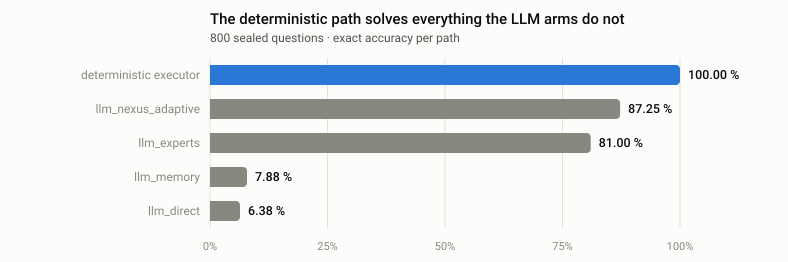
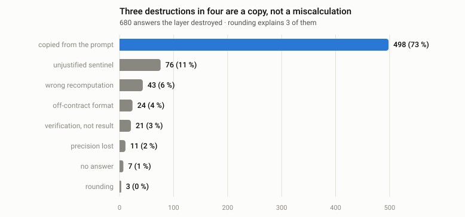

# What this harness found

The tool was built while measuring a real system: a math-reasoning scaffold
around a local 2B model, developed over several weeks. Every number below comes
from a sealed campaign whose ledgers can be replayed
(`validation/replay_mat9f.py`).

Nothing here is a benchmark claim. It is a record of what a paired comparison
sees that an aggregate score does not.

---

## 1. The deterministic path solved everything the LLM arms did not

<picture>
  <source media="(prefers-color-scheme: dark)" srcset="img/accuracy-dark.svg">
  
</picture>

The bare model answers 6.38 % of these questions correctly. Handed a
deterministic executor's proposal, it reaches 81 %. That gap — **+74.6
percentage points** — is the whole case for tool use, and it is real.

The gap that nobody was looking at is the other one. The executor alone is at
**100 %**. Every arm that routes through the model gives some of that back.

## 2. Every deviation was a degradation

Counted against the deterministic path rather than against the bare model:

| | deviations | improved | destroyed |
|---|---|---|---|
| campaign v1, four arms | 1 320 | **0** | 1 320 |
| campaign v2, four arms | 1 787 | **0** | 1 787 |
| expert-first, three arms | 664 | **0** | 664 |
| **total, 11 arm × run cells** | **4 316** | **0** | **4 316** |

Every single time the layer changed an answer the executor had already
computed, it made it worse. Not once did it repair one.

One caveat matters, and the harness reports it rather than hiding it: the
executor is correct on all 2 400 questions, so there was never an *opportunity*
to repair. The demonstrated result is the deviation count, not the absence of
repairs.

## 3. Three destructions in four are a copy

<picture>
  <source media="(prefers-color-scheme: dark)" srcset="img/failure-modes-dark.svg">
  
</picture>

```
2*(t+5)=12          proposal 1                →  model answered 2
5*z+1=-49           proposal -10              →  model answered 5*(-10)+1
32/7+43/17-17/24    proposal 18257/2856       →  model echoed the expression
```

The model is not calculating badly. **It is grabbing a number that is already
visible in its context.** Rounding — the culprit anyone would guess — explains
3 cases out of 680.

Two consequences follow, and both were measured:

- **Short integer answers are destroyed twice as often as long fractions**
  (32.1 % vs 16.0 %). What protects an answer is the absence of a copyable
  decoy, not its difficulty.
- **86 % of the damage is in algebra**, because algebra answers look like the
  operands in the question.

## 4. The prompt cannot fix it

The most protective wording the authors could write — *"report this result
unless you can demonstrate a specific error in it"* — still destroyed **26.5 %**
of correct answers.

| routing policy | destroyed |
|---|---|
| cross-check against memory | 46 % |
| executor has verified authority | 26.5 % |
| memory first, then verify | 10 % |

A verifying LLM placed after a deterministic result is a loss function. This is
an architectural finding, not a prompting one.

## 5. The 100 % was template coverage, not capability

Run against 25 real benchmark questions the executor had never seen:

| | |
|---|---|
| formalised | **2 / 25** |
| refused | 23 / 25 |
| **correct** | **0 / 25** |

Both accepted questions produced a precise, confident, wrong answer — a
compound-interest word problem answered `-9791/10` against a target of `1160`.

The 92 % refusal rate is correct behaviour. The 8 % it accepted is the defect,
and it was closed by a ten-line guard that keeps 800/800 on the original corpus
while rejecting both false positives.

## 6. The grader was wrong, and the bias was not random

Running two graders against the same 800 answers surfaced **43 correct answers
the original grader rejected**:

```json
{"answer":"-5","solution_type":"unique",
 "source":"deterministic_public_linear_executor",
 "verification":"substitution(t=-5)"}
```

The answer is right. The grader required an envelope containing `answer` and
nothing else, and the model had copied its tool's metadata alongside it.

| arm | rejected correct answers |
|---|---|
| llm_experts | 32 |
| llm_nexus_adaptive | 11 |
| llm_direct, llm_memory | 0 |

**The penalty fell only on the arms that received an expert proposal** — the
arms the campaign existed to measure. Reported accuracy for `llm_experts` was
73.25 % where the correct figure is **77.25 %**.

Nobody noticed across 33 training runs.

---

# Defects this work surfaced

## In the system under measurement

| Defect | Measured effect | What revealed it |
|---|---|---|
| The router could not express its own best policy | one family at 8 % instead of 96 % · **+5.88 pp** once fixed | comparing the adaptive arm's policy set to a fixed arm's |
| `pid` entered the campaign manifest hash | **no interrupted run could ever resume** · 1 574 generations lost to one GPU fault | attempting a resume after a crash |
| The grader demanded a strict envelope | **43 correct answers rejected**, all in the arms under test | two graders run against the same answers |
| Word problems parsed by number position | **171 destructions out of 200** | failure-mode breakdown |
| The executor accepted out-of-template input | 2 of 25 real questions accepted, **both wrong** | coverage measured on external questions |
| The scaffold applied even where it covered nothing | Nexus arms **below the bare model** on external benchmarks | aggregating a live campaign |

## In this harness

| Defect | Effect | What revealed it |
|---|---|---|
| `mcnemar_exact` overflowed the float range | **crash above ~1 000 discordant pairs** — precisely its own use case | extreme tests at 10 000 cases |
| Wilson returned `0.9999999999999999` for a perfect score | an interval that **did not contain its own proportion** | a metamorphic property test |
| One transient HTTP 500 killed an entire run | the same failure that cost 1 574 generations elsewhere | the first real end-to-end run |
| Provider failures were counted nowhere | low accuracy reported **without saying why** | design review after the 500 |

Six defects in the system it measured; four in itself. A tool that corrects
itself in public is worth more than one that always wins.

---

## Reproducing this

The v2 campaign replays from its ledgers and reproduces every published number
to the second decimal:

```bash
python validation/replay_mat9f.py
```

```
deterministic executor   800/800 = 100.00%
llm_direct                 6.38%   expected  6.38%   OK
llm_memory                 7.88%   expected  7.88%   OK
llm_experts               81.00%   expected 81.00%   OK
llm_nexus_adaptive        87.25%   expected 87.25%   OK

llm_experts              destroyed 152   improved 0   expected 152
llm_nexus_adaptive       destroyed 149   improved 0   expected 149
```

The measured system is a private research repository; the ledgers are not
public. The harness is, and it is the part that generalises.
